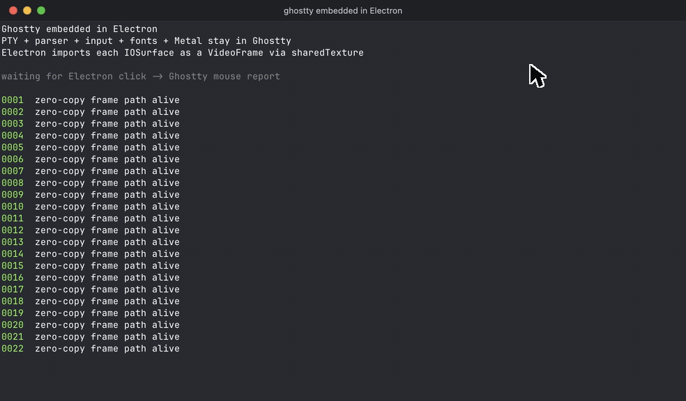

# ghostty-xterm-bench

**Experimental, pure research.** This repo answers one question:

> Can you embed a native terminal engine in Electron — without forking
> Chromium — and get its frames into the sandboxed DOM zero-copy?

Answer: yes. [ghostty](https://github.com/ghostty-org/ghostty) runs
headlessly inside an Electron app and owns *everything* — PTY + shell,
VT parsing, key/mouse encoding, selection, fonts/shaping, **Metal (GPU)
rendering** — and each presented IOSurface is imported into a fully
sandboxed `<canvas>` as a W3C `VideoFrame` via Electron's
[`sharedTexture`](https://electronjs.org/docs/latest/api/shared-texture)
module (Electron ≥ 41; the same path `<video>` frames take). No pixels
are ever copied over IPC. By default the engine doesn't even run in the
Electron main process: it lives in a **utilityProcess**, so a busy or
crashed terminal can't stall window management — and the zero-copy
property survives the process boundary (what crosses per frame is a
mach send-right plus small frame metadata).

The best current outcome is the embed itself: Ghostty can run headlessly
inside Electron with a small additive fork patch, while Electron remains
the window/compositor. The embedding lives in
[`packages/electron-ghostty`](packages/electron-ghostty)
as a reusable (deliberately unpublished) package; the demo and tests
consume it like a dependency. The repo also carries DOM-terminal
benchmarks (xterm.js + WebGL, ghostty-web WASM) used for the historical
comparison below.

## Motivation

VS Code's terminal keeps everything — VT parsing, buffer state,
rendering — on the renderer process's JavaScript thread. Heavy output
floods are parse-bound in JS and saturate the same thread that handles
keystrokes, so the terminal feels worst exactly when it's busiest.
Proposals to swap ghostty in as VS Code's terminal
(microsoft/vscode#236991) were closed as out of scope — for good
reasons that are mostly *not* about rendering: maintenance control
over a critical component, xterm.js's decade of tailored engineering,
the frontend/backend split that Remote/Codespaces depend on. But one
technical premise in that discussion space was always assumed: a
native engine has no way to get its pixels into a sandboxed renderer's
DOM without copying or forking Chromium.

That specific premise changed with Electron's `sharedTexture` module.
This repo is the working proof — plus an attempt to measure honestly
what the architecture buys and what it doesn't. (The non-rendering
reasons above still stand; this is research, not a VS Code proposal.)

<picture>
  <source media="(prefers-color-scheme: dark)" srcset="assets/benchmarks-dark.svg">
  
</picture>

<p align="center">
  
</p>

## What works today (macOS)

- `npm run demo` — a real interactive shell in an Electron window,
  rendered by ghostty's own Metal renderer. Typing, paste (both
  clipboard directions incl. OSC 52), mouse clicks/drag/wheel
  (through ghostty's mouse encoder — try htop or `vim` with
  `:set mouse=a`), window resize with grid reflow + SIGWINCH,
  scrollback, IME composition, focus reporting, title/pwd/bell
  events, multiple terminals per page (slots), config passthrough
  (any ghostty option). `--engine=main` runs the engine in-process
  instead of the default utilityProcess.
- `npm run demo:gif` — deterministic 30 fps demo capture with
  terminal-only content, a visible cursor, and a click interaction;
  writes `results/demo-ghostty.gif`
  if `ffmpeg` is installed. The checked-in README GIF uses content
  capture so it cannot include unrelated desktop pixels. Pass
  `-- --record-native-window` to experiment with macOS screen capture.
- `npm run bench` — in-terminal flood, all three backends (xterm.js,
  ghostty-web, ghostty embedded), burst + sustained.
- `node bench/run.js pty` — the PTY race: throughput + interrupt
  through a real zsh; `--sweep` runs the issue-#10 watermark sweep.
- `node bench/engine-placement.js` — engine placement comparison.
- `npm run bench:stock` — Electron overhead vs stock Ghostty.app.
- `npm test` + `npm run test:integration` — e2e against real
  IOSurface pixels plus Electron integration: both engine placements,
  the utility-process protocol suite, multi-terminal slots, and the
  embedder API (title/clipboard/config verified in pixels).

Not implemented yet (contributions/discussion welcome): link
clicking (the `open-url` event fires; nothing opens it), kitty
graphics, search. See `packages/electron-ghostty/README.md`.

## Measured (reproducible from HEAD)

All numbers: macOS, Apple Silicon @2x, Electron 42, medians. The chart
above is generated by `scripts/hero-chart.js` from `results/`.

### In-terminal flood — `npm run bench`

10 MiB sustained, bytes → last frame presented:

| backend | e2e | note |
|---|---|---|
| xterm.js + WebGL | 1,198 ms | write() straight into the parser |
| ghostty-web WASM | 266 ms | write() straight into the parser |
| ghostty embedded | **225 ms** | **through a real PTY** — includes pipe overhead the DOM rows don't pay |

### PTY race — `node bench/run.js pty`

`cat` 50 MiB through a real `zsh -f`; finish line = completion
sentinel *visible* (DOM: buffer scan; ghostty: OSC title event plus
the next frame containing marker text). DOM backends get VS
Code-style flow control at **VS Code's real constants** (100 K/5 K/5 K):

| backend | cat 50 MiB | MB/s | Ctrl+C mid-flood → response |
|---|---|---|---|
| xterm.js | 4,720 ms | 10.6 | 19.2 ms |
| ghostty-web | 4,364 ms | 11.5 | 61.6 ms |
| ghostty | **1,133 ms** | **44.2** | **9.9 ms** |

### The issue-#10 answer — `node bench/run.js pty --sweep`

The historical 24× interrupt headline was measured with a 32 MiB
pause watermark, ~335× VS Code's real constant. The sweep measures
xterm.js at four HIGH watermarks (LOW/ack scale as HIGH/20):

| HIGH watermark | cat 50 MiB | MB/s | interrupt |
|---|---|---|---|
| VS Code (100 KB) | 4,720 ms | 10.6 | **16.5 ms** |
| 1 MiB | 2,170 ms | 23.0 | 28.2 ms |
| 8 MiB | 2,316 ms | 21.6 | 68.7 ms |
| 32 MiB (old bench) | 2,402 ms | 20.8 | **1,002 ms** |
| ghostty (no knob) | **927 ms** | **53.9** | **10.1 ms** |

So the honest conclusion issue #10 asked for: **the old 24× interrupt
number was largely a flow-control artifact** — at VS Code's actual
constants, xterm.js recovers in ~17 ms, not ~1.1 s, and the honest
ratio vs ghostty is ~1.6×, not 24×. The trade-off is real but it
belongs to the *window size*: xterm.js must choose between throughput
(large window: 2.2× faster cat, 60× worse interrupt) and
responsiveness (VS Code's window: snappy Ctrl+C, half the
throughput). **ghostty doesn't have the knob** — owning the PTY gives
inherent backpressure, and it wins both axes simultaneously (2–4×
the throughput of xterm's best point at better-than-best interrupt
latency). That trade-off-free line is the architectural claim, and it
survived the audit.

### Does the engine's process placement matter? — `node bench/engine-placement.js`

Same embedding, same zero-copy path — the engine in the Electron main
process vs a utilityProcess. Median of 5 interleaved runs, real
`zsh -f`, 100 MiB sustained `cat`:

| metric (median of 5) | main | utility |
|---|---|---|
| 100 MiB flood → presented | 1,664 ms | 1,682 ms (~1%, noise) |
| main process blocked at terminal spawn | 28.9 ms | **4.2 ms (7×)** |
| first frame presented | 281 ms | 236 ms |
| main-loop lag p99 during flood | 1.7 ms | 1.6 ms (wash) |

The honest read: **throughput is identical** — ghostty's IO/render
threads were never on the main process's JS thread to begin with. What
the utilityProcess buys is crash isolation (kill the engine, the app
survives — tested), 7× less main-process blocking at spawn, and
protection against a wedged engine. That, not raw speed, is the reason
it's the default.

## Historical results (not reproducible from HEAD)

Earlier iterations of this repo benchmarked a different architecture:
**libghostty-vt parsing in the main process + a hand-rolled CPU
rasterizer** presenting via sharedTexture, raced against xterm.js and
ghostty-web with VS Code-style flow control, conformance/fuzz-tested
against `@xterm/headless`. Those harnesses (parser suite, 1 GiB PTY
race, input latency, leak soak, render stress, the Windows D3D11
producer, and the conformance/fuzz layers) were **removed** in the
move to full-ghostty embedding
([`c116b9f`](https://github.com/mxschmitt/ghostty-xterm-bench/commit/c116b9f));
they last exist at
[`1a4357c`](https://github.com/mxschmitt/ghostty-xterm-bench/tree/1a4357c),
where every number below was
measured and can be reproduced.

Headlines from that iteration (macOS, Apple Silicon @2x, medians;
details and method in the
[`1a4357c` README](https://github.com/mxschmitt/ghostty-xterm-bench/blob/1a4357c/README.md)):

- Parser only: libghostty-vt 237 MB/s vs xterm.js headless 19.7 MB/s
  (~12×), ghostty-web WASM between the two (58.4 MB/s).
- 10 MiB in-terminal flood: 66 ms vs 1,200 ms e2e (~18×).
- 1 GiB PTY `cat`: 25.6 s vs 55.4 s (~2.2×, pipe-bound; ghostty-web
  actually completed fastest at 20.3 s).
- Ctrl+C under flood: 47 ms vs 1,124 ms recovery (~24×) — measured
  with a **32 MiB flow-control window**. The rebuilt sweep (above)
  showed that number was largely a flow-control artifact: at VS
  Code's real constants xterm recovers in ~17 ms. This is exactly
  what [#10](https://github.com/mxschmitt/ghostty-xterm-bench/issues/10)
  suspected, now measured.
- Input latency under load: 11.6 ms vs 36.1 ms p50 (not yet rebuilt
  against the new architecture).

## How it works

```
┌────────────────────────┐   mach send-right       ┌───────────────────┐
│ utilityProcess (host)  │ ──── parentPort ──────► │ main process      │
│  ghostty:              │ ◄─── frame-ack ──────── │  IOSurfaceLookup  │
│   PTY + shell          │                         │  sharedTexture    │
│   VT parse, input enc  │                         │  .importShared…   │
│   fonts, Metal render  │                         └────────┬──────────┘
│   → IOSurface          │                                  │ zero-copy
└────────────────────────┘                                  ▼
                                                   ┌───────────────────┐
                                                   │ sandboxed renderer│
                                                   │  VideoFrame →     │
                                                   │  <canvas>         │
                                                   └───────────────────┘
```

One small functional patch to a pinned ghostty checkout makes this
possible (`patches/0002`, applied by `npm run setup:ghostty`;
`patches/0001` only installs the static library/header on macOS): the
headless apprt platform — `GHOSTTY_PLATFORM_HEADLESS` (a surface with no
NSView; the Metal backend's IOSurfaceLayer works standalone) plus
`ghostty_surface_headless_frame()` returning the last presented
IOSurface. This is the piece worth proposing upstream — small,
additive, independently useful for screenshots, testing, and
embedding.

Frames cross the engine→main process boundary as **mach send-rights**
(`IOSurfaceCreateMachPort` in the host, a bootstrap-registered channel
— Electron's `parentPort` can't carry mach rights —
`IOSurfaceLookupFromMachPort` in the parent). That's Apple's
recommended mechanism for passing a surface "atomically or securely to
another task": the port itself is an unguessable capability, no fork
patch needed. Each in-flight port holds +1 on the surface's global use
count, so a frame can't be recycled mid-transfer.

The rendezvous *name* the two processes use to find each other lives
in the shared per-user bootstrap namespace, so the real trust boundary
is same-user (a process running as you can already screenshot or
ptrace the app). The name is randomized rather than relied on as a
secret; see [`SECURITY.md`](SECURITY.md) for the threat model.

The N-API addon (`packages/electron-ghostty/src/addon.c`, ~1k lines)
is marshalling around `ghostty.h` plus that mach channel — ghostty
does the work.

## Platform matrix (honest)

| | status |
|---|---|
| macOS (arm64) | ✅ working end-to-end: Metal render, IOSurface zero-copy, CI runs e2e + integration + DOM benches |
| Linux | 🟡 the patched libghostty **compiles** in CI and the DOM baselines run under xvfb; native presentation needs an EGL/GBM/dmabuf presenter (probe experiments in `native/renderer-poc/`, not yet reproducible/integrated) |
| Windows | ⬜ no presentation path in the current architecture. (The previous CPU-rasterizer iteration had a working D3D11/DirectWrite producer — last at [`1a4357c`](https://github.com/mxschmitt/ghostty-xterm-bench/tree/1a4357c); porting that idea to ghostty's D3D backend is unexplored) |

## Fairness engineering

Most of the historical numbers' credibility work is documented in the
[`1a4357c` README](https://github.com/mxschmitt/ghostty-xterm-bench/blob/1a4357c/README.md) ("Fairness
engineering": same pixels, same finish line, flow control for xterm,
`zsh -f` + READY handshakes, backgroundThrottling off, inert
sentinels, pipe-ceiling controls). Two rules carried into the current
benchmarks:

- **Same finish line** — the clock stops when output is *presented*
  (frame confirmed), or at a state ghostty itself observes (shell
  exit), never "the bytes were swallowed".
- **Interleaved runs** — A,B,A,B per iteration so machine drift hits
  both configurations equally (`bench/engine-placement.js`).

## Run it

macOS (arm64 tested) — Node 22.23.1 (pinned in `.node-version`),
Xcode CLT,
[zig](https://ziglang.org) matching ghostty's pin (0.16.0):

```bash
npm install
npx @electron/rebuild -f -w node-pty   # node-pty against Electron (PTY race only)
npm run setup:ghostty  # clone ghostty into vendor/, apply patches, zig build (~5 min)
npm run build:native   # node-gyp build of the N-API addon
npm run payload        # generate the 1 MiB test payload
npm test               # e2e against real IOSurface pixels, no GUI needed
npm run demo           # a live shell, ghostty-rendered, in Electron
npm run demo:gif       # optional: write results/demo-ghostty.gif (ffmpeg)
npm run bench          # in-terminal flood, all three backends
node bench/run.js pty              # PTY race: throughput + interrupt
node bench/run.js pty --sweep      # the issue-#10 watermark sweep
node bench/engine-placement.js     # engine placement comparison
node scripts/hero-chart.js         # regenerate the README chart from results/
```

On Linux the same steps build the fork and run the DOM benchmarks
under xvfb; the native embedding is macOS-only for now.

## Layout

```
packages/electron-ghostty/  the embedding as a reusable package
  index.js                    GhosttyTerminal (engines, present loop, input)
  host.js                     utilityProcess engine host (default placement)
  preload.js                  sandboxed renderer side (canvas paint + input)
  src/addon.c                 N-API wrapper around patched libghostty
demo-ghostty-renderer/      live interactive shell using the package
bench/                      flood (DOM terminals) + engine-placement
patches/                    the two ghostty fork patches
scripts/                    ghostty build, payload gen, chart gen, CI summary
test/                       e2e (pixels) + Electron integration suites
docs/                       design notes (see header disclaimers for age)
native/renderer-poc/        Linux EGL/headless probe experiments
```

## Caveats

- Research-grade. The package is not published and its API will change.
- ghostty is pinned (`scripts/setup-ghostty.sh`); the embedding pokes
  one private detail (the IOSurfaceLayer `contents` property) that an
  upstream API should replace.
- Absolute wall times vary with machine load; per-run pairings and
  ratios are the stable result.
