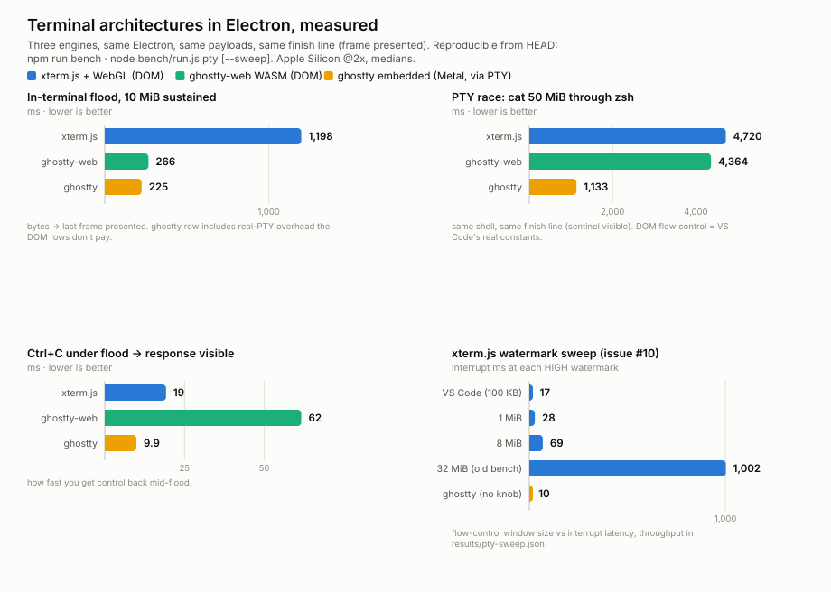

# ghostty-xterm-bench

A fair, measured comparison of three terminal architectures inside Electron:

1. **xterm.js + WebGL addon** — parse *and* render inside the Chromium
   renderer process. This is how VS Code's integrated terminal works today.
2. **ghostty-web (WASM)** — [coder/ghostty-web](https://github.com/coder/ghostty-web):
   ghostty's VT engine compiled to WebAssembly with an xterm.js-compatible
   API, parsing and canvas-rendering in the same renderer process. Same
   architecture as xterm.js, different engine.
3. **libghostty-vt + sharedTexture** — [libghostty-vt](https://github.com/ghostty-org/ghostty)
   (ghostty's native VT engine) parses in the main process, a native addon
   draws the grid into an **IOSurface**, and Electron's `sharedTexture`
   module transfers it **zero-copy** into a fully sandboxed renderer
   `<canvas>` as a `VideoFrame`.

Two of the three run the *same* ghostty parser, and two of the three share
the *same* in-renderer architecture — so the comparison separates the
engine effect from the architecture effect on every metric.

<picture>
  <source media="(prefers-color-scheme: dark)" srcset="assets/benchmarks-dark.svg">
  
</picture>

## Motivation

VS Code's terminal keeps everything — VT parsing, buffer state, rendering —
on the renderer process's JavaScript thread. That has two structural costs:
heavy output floods are parse-bound in JS, and they saturate the same thread
that handles your keystrokes, so the terminal feels worst exactly when it's
busiest. Proposals to swap in a native terminal engine were historically
dismissed as "you'd have to fork Chromium to get native pixels into the DOM"
(microsoft/vscode#236991 was closed as out of scope).

That premise changed: Electron ≥41 ships a `sharedTexture` module that turns
a native GPU surface (macOS `IOSurface`, Windows D3D11 `NT HANDLE`, Linux
dmabuf) into a W3C `VideoFrame` the sandboxed renderer can paint zero-copy —
the same path `<video>` and WebRTC frames use. So the interesting question
became answerable without forking anything:

> If a native terminal engine parsed in the main process and shipped frames
> to the DOM via sharedTexture, how would it actually compare to xterm.js —
> measured end-to-end, fairly?

This repo is that measurement: both terminals run in the same Electron
(42.5.0), on the same payloads, with the same grid (120×30 at
`devicePixelRatio`), and finish lines that mean "the frame was actually
presented", not "the bytes were swallowed".

## The three benchmark layers

Each layer isolates one slice of the stack. All numbers below: macOS,
Apple Silicon (M-series) @2x, attended runs, medians. Reproduce with the
commands shown; raw JSON lands in `results/`.

### 1. Parser only — `npm run bench:parse` (any OS, no GUI)

The identical byte stream through three VT engines in plain Node:

| | xterm.js headless | ghostty-web (WASM) | libghostty-vt (native) | native vs xterm |
|---|---|---|---|---|
| macOS arm64 (M-series) | 19.7 MB/s | 58.4 MB/s | 237.2 MB/s | **12.0×** |
| Windows x64 (CI runner) | 4.0 MB/s | *see CI* | 98.5 MB/s | **24.4×** |

Three engines, two of them the *same* ghostty parser:
[coder/ghostty-web](https://github.com/coder/ghostty-web) compiles ghostty's
VT engine to **WASM** with an xterm.js-compatible API (it's what the Mux
desktop app ships); libghostty-vt runs that same engine **natively** through
an N-API addon. So the three rows separate two effects cleanly:

- **engine** — ghostty-web is already **3.0× xterm.js** on the same payload,
  purely from swapping the JS emulator for ghostty's, before any native code
  is involved.
- **sandbox** — native libghostty-vt is a further **4.1×** over ghostty-web:
  the cost of the WASM boundary (bulk `write` copies into WASM linear memory,
  no SIMD/threads) on an otherwise identical parser.

The native-vs-xterm gap *widens* on Windows: the native parser loses less to
the slower hardware than the JS one does. (Windows numbers come from the
GitHub-hosted runner via CI — see any run's job summary, which now includes
the ghostty-web row too; the Windows xterm-in-Electron baseline also runs
there: 1 MiB burst ≈ 423 ms e2e.)

ghostty-web ships for the browser — its default loader reaches for
`self.location` — so the benchmark shims that one global and drives its
headless `Ghostty.load()` / `createTerminal().write()` path (base64 WASM over
Node's `fetch`), feeding it the identical byte chunks the native addon gets.
If the WASM can't load on some runner, the harness logs it and falls back to
the xterm-vs-native pair.

### 2. In-terminal flood — `npm run bench` (Electron, macOS)

Feed the payload directly to each terminal at full speed and stop the clock
when the final frame is confirmed presented (double-rAF / frame ack):

| mode | xterm.js e2e | ghostty-web e2e | libghostty e2e | native vs xterm |
|---|---|---|---|---|
| burst (1 MiB) | 139 ms | 111 ms | 24 ms | **5.8×** |
| sustained (10 MiB) | 1200 ms | 968 ms | 66 ms | **18.3×** |

ghostty's native draw cost for the entire sustained run is ~3 ms — dirty-row
tracking plus glyph runs make presentation nearly free; the gap is the parser.
ghostty-web's 3× parser advantage largely evaporates here: its feed loop
shares the renderer's JS thread with its own 2D-canvas painter (and the
event-loop yields that keep the window responsive), so end-to-end it only
edges out xterm.js by ~1.2×. The flood is capped by the in-renderer
architecture, not the engine — which is precisely the effect the third row
exists to isolate.

### 3. The full-stack PTY race — `npm run bench:pty` (Electron, macOS)

A real zsh on a real PTY (node-pty). `cat` a 1 GiB file; the clock stops when
the completion sentinel is **visible on screen**. A separate run measures
interrupt recovery: Ctrl+C mid-flood, then time until a fresh echo is visible.

| terminal | cat 1 GiB | MB/s | Ctrl+C→response | CPU | mem growth |
|---|---|---|---|---|---|
| xterm.js | 55.4 s | 18.5 | 1124 ms | 5.9 s | 320 MB |
| ghostty-web | **20.3 s** | 50.3 | 424 ms | 3.4 s | 144 MB |
| ghostty | 25.6 s | 40.0 | **47 ms** | 2.9 s | 25 MB |

Through a real PTY the plumbing dominates: node-pty delivers ~1 KB chunks and
caps the pipe at ~50–65 MB/s (a control run reports this ceiling). Both
ghostty-engine terminals run at or near that ceiling — ghostty-web actually
*completes* fastest (its cat run sat closest to the 64 MB/s pipe ceiling on
this run), and at small sizes (≤8 MiB) the completion gap vanishes entirely.
The metric that stays dramatic is responsiveness: **24× faster interrupt
recovery for native ghostty** (47 ms vs 1124 ms — xterm has to chew its
flow-control backlog before your keystroke's effect appears; ghostty-web,
same in-renderer flow control, still needs 424 ms), at ~2× less CPU and ~13×
less memory growth. This is the honest headline: *architecture buys you
latency under load more than it buys you raw completion time — and the
interrupt row is the one where only main-process parsing helps.*

### Input latency — `npm run bench:pty -- --latency` (macOS)

Keystroke → echo visible on screen, at an idle prompt and under a
2 000 lines/s "build output" load (under an *unthrottled* flood the screen
scrolls millions of lines/s and a typed echo never lands on a presented
frame in any terminal — unmeasurable by definition):

| terminal | idle p50 | busy p50 |
|---|---|---|
| xterm.js | 32.5 ms | 36.1 ms |
| ghostty-web | 16.8 ms | 24.5 ms |
| ghostty | **17 ms** | **11.6 ms** |

(ghostty-web row measured on a later, loaded run — its idle latency matches
native ghostty's, as expected for the same engine; under load it sits between
the two.)

### Leak soak — `npm run bench:pty -- --soak-min 10`

Ten minutes of continuous full-speed output per terminal, memory sampled
every 2 s, least-squares slope after warm-up must stay under 10 MB/min:
ghostty consumed **28.2 GB** (slope 0.29 MB/min), xterm 15.2 GB (slope 0) —
both flat, no leaks. CI runs a 2-minute version on every push. ghostty-web
is measured and reported but excluded from the pass/fail gate (its WASM heap
grew ~30 MB/min on a CI 2-min soak — upstream ghostty-web behavior, not this
repo's code; the gate exists to catch leaks in the native addon).

### vs stock Ghostty.app — `npm run bench:stock` (macOS)

How much does Electron cost? Same 256 MiB, same write-side finish line
(`cat` completes; stock apps' screens can't be read programmatically):

| | stock Ghostty (native) | ghostty-in-Electron | xterm-in-Electron |
|---|---|---|---|
| cat 256 MiB | **3.5 s** | 5.6 s | 11.3 s |

Electron + node-pty's ~1 KB chunking costs the libghostty pipeline ~1.6×
vs the fully native app; xterm.js doubles it again.

### Does the CPU rasterizer need a GPU replacement? — `npm run bench:render`

Worst case by construction: 4K-equivalent surface, every cell changing
every frame (zero dirty-row savings). Result: **325 full redraws/s
(3.07 ms avg)** against the 8.3 ms 120 Hz budget — the CPU rasterizer holds
120 Hz at 4K full damage with ~2.7× headroom. Measured evidence that a
Metal/GPU pass isn't needed at current targets.

### Feel it yourself — `npm run demo` (macOS)

Two windows, each a real interactive shell: left xterm.js, right ghostty —
with mouse selection, double-click word selection, Cmd+C/Cmd+V, Cmd+F
search over scrollback, Cmd+click to open URLs, IME composition, cursor
blink, wheel scrollback, and mode-aware arrow keys for vim/less. Mouse
reporting goes through libghostty's mouse encoder: click a process in
htop, drag-select in vim with `:set mouse=a`, wheel-scroll htop's list —
wheel falls back to arrow keys for `less` (alternate scroll) and to our
scrollback otherwise, and shift+drag bypasses the app for local selection,
like every native terminal. Run `time cat payload.txt`, `find /`, or hold
a key in vim, side by side.

## Platform matrix

All three OSes run in CI on every push:

| | macOS (arm64) | Windows (x64) | Linux |
|---|---|---|---|
| libghostty-vt build (zig) | ✅ | ✅ (msvc ABI) | ✅ |
| parser benchmark + conformance/fuzz tests | ✅ | ✅ | ✅ |
| DOM terminal benchmarks (xterm.js, ghostty-web) | ✅ | ✅ | ✅ (xvfb + SwiftShader) |
| native presentation producer | ✅ IOSurface + CoreText | ✅ D3D11 + DirectWrite — pixel + render-equivalence tests pass on CI (WARP) | ⬜ needs dmabuf |
| in-Electron sharedTexture GUI | ✅ | 🟡 implemented; validation on GPU-less runners in progress | ⬜ |
| PTY race + latency + soak | ✅ | 🟡 runs, but **ConPTY caps the pipe at ~0.1 MB/s** on runners — Windows PTY numbers measure ConPTY, not the terminals | ⬜ |

The addon split: `native/src/vt.c` (session, parsing, text readout, key
encoding, selection, search) builds everywhere; `producer_mac.m` (CoreText →
IOSurface) and `producer_win.cc` (DirectWrite/D2D → shared D3D11 textures,
hardware with WARP fallback) are the presentation layers; `producer_stub.c`
covers Linux until a dmabuf producer exists. The same pixel-level and
incremental-vs-full-redraw equivalence tests run against both renderers.

## Fairness engineering

Getting these numbers to mean something was most of the work. Everything
below is baked into the harnesses because we hit it:

- **Same pixels:** both render at `devicePixelRatio` (an early version ran
  ghostty at 1× — a 4× pixel discount, in ghostty's favor, fixed).
- **Same finish line:** "sentinel visible on screen", detected in the grid
  and confirmed presented — never "cat exited", which on a backlogged
  terminal happens minutes early.
- **Flow control for xterm:** VS Code-style PTY pause/resume + 4 ms IPC
  batching. Without it, per-chunk IPC collapses xterm's throughput ~250×
  and a 1 GiB flood OOMs the renderer. ghostty needs neither — main-process
  parse gives inherent backpressure.
- **`zsh -f` + READY handshake:** rc-file startup otherwise buffers the
  command for seconds and pollutes t₀.
- **`backgroundThrottling: false` everywhere:** an occluded window gets its
  rAF suspended — an unattended overnight run once reported xterm 11.9×
  slower at 1 GiB when ~18 of its 20 minutes were our detector waiting for a
  frame Chromium had parked. The corrected, attended number is 2.2×. (VS
  Code disables backgroundThrottling for the same class of reason.)
- **Inert sentinels:** written as `$((…))` arithmetic so the echoed command
  line can never false-match; matched with `endsWith` so a missing trailing
  newline can't hang detection.
- **Pipe-ceiling control:** the same file through node-pty into a no-op
  consumer, reported next to the results, so pipe-bound results are legible
  as such.

## What's proven, and how

Four test layers (`npm test` + `npm run test:integration`, all in CI):

1. **Addon tests** — pixel-level assertions against the actual IOSurface
   (`readPixels`): SGR colors land in the right cells, cursor drawn, box
   drawing renders as aligned geometry; dirty tracking across double
   buffering; scrollback; resize; selection; **mode-aware key encoding**
   (ArrowUp flips `\e[A`→`\eOA` under DECCKM, like vim expects);
   **mode-aware mouse encoding** (nothing until the app enables tracking,
   SGR/legacy formats, pixel→cell mapping, wheel buttons, drag motion
   deduped by cell, hover motion only in any-event mode).
2. **Render-equivalence invariant** — after any incremental update sequence,
   the frame must be pixel-identical to a from-scratch full redraw. This is
   the regression net for the entire "corrupted TUI" bug class (glyph bleed,
   dirty-tracking misses) — we caught real bugs with it.
3. **Conformance + fuzz** — curated VT streams *and* 40 seeded random
   streams diffed row-by-row against `@xterm/headless` (the exact emulator
   VS Code ships), including the full 1 MiB benchmark payload. The speed
   comparison only counts because both engines demonstrably do the same
   work. The fuzzer found two genuine emulator divergences (DECRC after a
   DECSTBM scroll; DECOM homing after DECSTBM) — both pinned as tests and
   written up with minimal repros in `docs/upstream-divergences.md`.
4. **Electron integration** — the real apps run end-to-end on CI: both
   benchmarks produce sane per-stage stats and screenshots, the PTY race
   completes at 8 MiB with valid metrics, the demo round-trips a live
   zsh echo through both keyboard→PTY→parser→render pipelines, and the
   mouse smoke test synthesizes OS-level clicks/drag/wheel into the real
   renderer and verifies a mouse-tracking PTY app receives the exact SGR
   sequences at the clicked cells.

CI runs the full suite on macOS (Apple Silicon runner, including the
Electron GUI apps and benchmarks — numbers in each run's job summary) and
the portable subset plus xterm baseline on Windows.

CI also runs the input-latency probe, a 2-minute soak, the render-stress
benchmark, and compares every metric against the previous main run in the
job summary (drift >20% gets flagged). The embedding itself lives in
`packages/electron-ghostty` — a reusable (not yet published) package; the
demo and tests consume it like a dependency.

## Run it

macOS (arm64 tested) — Node ≥ 20, Xcode CLT, [zig](https://ziglang.org)
matching ghostty's pin (0.15.2):

```bash
npm install
npm run payload        # generate the 1 MiB test file
npm run setup:ghostty  # clone ghostty into vendor/ and build libghostty-vt
npm run build:native   # build the N-API addon
npm test               # addon + conformance + fuzz (fast, no GUI)
npm run bench:parse    # parser-only comparison (any OS)
npm run bench          # in-terminal burst + sustained (Electron)
npm run bench:pty      # the 1 GiB PTY race (add --mb 64 for a quick run)
npm run demo           # side-by-side live shells
```

On Windows and Linux the same steps run the parser suite and the DOM
backends (xterm.js, ghostty-web); the native ghostty side of `bench`,
`bench:pty`, and `demo` needs the macOS producer. `bench:pty` drops the
native backend automatically where the addon has no platform renderer.

## Layout

```
bench/                     THE benchmark app — all suites, all terminals
bench/backends.js            the terminal registry (add a terminal here)
bench/run.js                 entry point: parse | flood | pty
bench/parse.js               parser-only suite (plain node, every OS)
bench/flood*.js|.html        in-terminal flood (DOM backends + native)
bench/pty-main.js|pty-dom…   PTY race / latency / soak, per-backend runners
bench/dom-terminal.js        one factory for xterm.js-compatible libraries
packages/electron-ghostty  the embedding as a reusable package:
  index.js                   GhosttyTerminal (present loop, input, resize)
  preload.js                 sandboxed renderer side (canvas paint + input)
  src/addon.c                N-API wrapper around patched libghostty
scripts/                   payload gen, ghostty build, chart gen, CI reporting
demo-ghostty-renderer/     live interactive shell using the package
test/                      addon, conformance, fuzz, integration suites
```

Adding a terminal: register it in `bench/backends.js` (a `dom`-kind backend
that speaks the xterm.js API needs only a `dom-terminal.js` factory case);
every suite, the CI summary, and the regression compare pick it up from the
registry.

## Caveats

- libghostty-vt is alpha; its headers warn of breaking changes. Pin the
  vendor checkout for stability.
- The macOS renderer is a CPU rasterizer into an IOSurface — already cheap
  enough (~sub-ms/frame incremental) to vanish in these numbers; ghostty's
  real GPU renderer isn't exposed through libghostty yet.
- Not implemented (doesn't affect the numbers): links, search, IME
  composition, ligatures, kitty graphics, blinking cursor.
- Absolute wall times vary with machine load; the per-run pairings and the
  ratios are the stable result. Every table above says which run produced it,
  and CI reproduces the small/medium configurations on every push.
